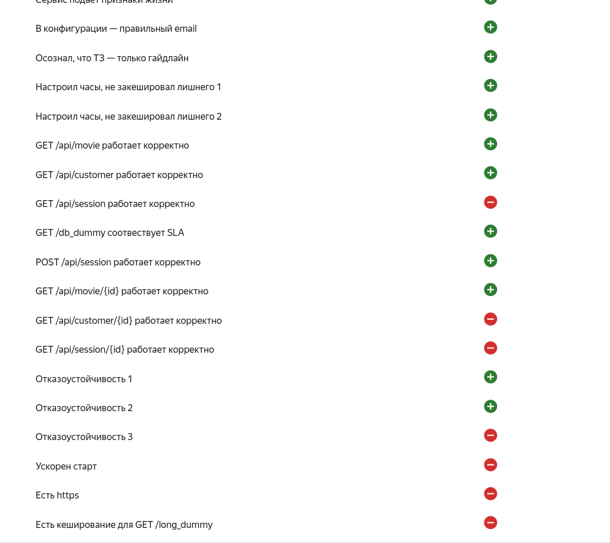
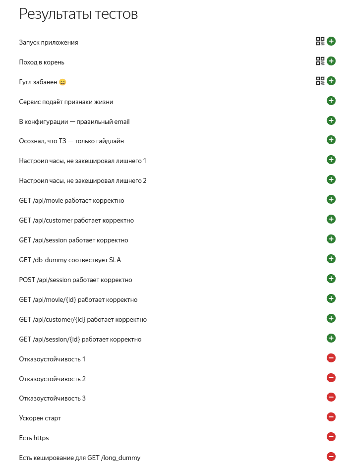

Запуск приложения
==========================
для запуска бинарника надо сделать его исполняемым
`chmod u+x адрес_файла`


Запуск приложения без аргументов просто выдавало `Hello world`

Вспомнил что надо бы посмотреть есть ли справка в приложении ./bingo -h
в ответ получил команды и флаги

Далее получил дефолтный конфиг `./bingo print_default_config`
сохранял под разными имена с раcширениям yaml, так как по внешнему виду было понятно что этот тот формат конфига.
Пробовал разные пути, но безуспешно.

Далее смотрел сам бинарник в надежде найти по ключевым словам (config, yaml, develop, product) находил много чего, но только не путь к конфигу.
`cat ./bingo | grep -a -B 2 -A 2'config'`


После нескольких пересмотров 3 лекции про процессы от Мичурина Андрея, попробовал утилиту `strace -f ./bingo print_current_config`, но тоже не разобрался.
Сделав паузу вспомнил, что не плохо бы почитать help к утилите, после чего нашел другой флаг `-ff`

Снова запустил `strace -f ./bingo print_current_config` и о чудо заветный путь, далее кофиг был отправлен по пути `/opt/bingo/config.yaml`

Создал docker-compose_local.yaml файлик и запихнул туда postgresql
Потом запустил наполнение тестовыми данными БД `./bingo prepare_db`
Попытка завести сервер `./bingo run_server` выдала ошибку

Снова ищем ошибку через знакомую утилиту `strace -ff ./bingo run_server`

Путь и название лог файла
`/opt/bongo/logs/e9d5cee93d/main.log`

Обнаруживаем, что нет директорий логов и самого лог файла
Добавляем запускаем, опять ошибка, нет прав, добавляем права

Опять пробуем запустить сервер `./bingo run_server`
Получаем поздравление о запуске сервера и кодовое слово (Кстати кодовое слово я получал через grep когда искал путь до конфига, но не понял что это оно)

Первый код

```
My congratulations.
You were able to start the server.
Here's a secret code that confirms that you did it.
--------------------------------------------------
code:         yoohoo_server_launched
--------------------------------------------------
```

Далее ищем на каком порту стартануло приложение `netstat -l -p | grep bingo`
В моем случае на 4049
Переходим в браузере на http://localhost:4049/
Видим еще кодовое слово

Второй код

```
Hi. Accept my congratulations. You were able to launch this app.
In the text of the task, you were given a list of urls and requirements for their work.
Get on with it. You can do it, you'll do it.
--------------------------------------------------
code:         index_page_is_awesome
--------------------------------------------------
```

Третий код был уже найден читерским способом  

Нелегальная команда получения всех code `cat ./bingo | grep -a 'code:  '`

Третий код
`google_dns_is_not_http`

Он послужил подсказкой, что еще надо сделать (при старте приложения видел запросы к 8.8.8.8), но оставил я это на потом.

Деплой
===================================
Посмотрев разбор дз от Владимира Кононова, был взят за основу файл `terraform` из разбора

Сначала собрал стенд из 2 инстанс групп в одной были 2 машины под приложение, во второй одна под БД.

В этом подходе потерял много времени, так как каждый раз когда опускал поднимал стенд, машина с БД умирала, а вместе с ней и БД.

Тогда переосмыслив, что БД это часть инфры, я заранее поднял машину с БД (поднял БД в докере) накатил миграции
и прописал ее в файлик terrafom 

Жаль что понял я это в последний день((

Запуск первых тестов
==================================
Начальная конфигурация была простая, приложение просто было завернуто в докер
проходил тест отказоустойчивости 1 и 2

первый вариант лежит тут `terraform_f/docker-compose_V1.yaml`



установил `wkr`, начал тестировать локально приложение

прошелся по всем ручкам, средний latency/rps был `900ms/35` плюс процент ошибок был высокий. погруснел(

В логах контейнера БД увидел ошибки и решил вообще заглянуть в БД.

Обнаружил что нет индексов, данные не нормализованы.

нормализация и оптимизация БД
===================================
Установка primary key на все таблицы
```
alter table sessions
    add constraint sessions_pk
        primary key (id);

alter table movies
    add constraint movies_pk
        primary key (id);


alter table customers
    add constraint customers_pk
        primary key (id);
```

Установка `forigenkey` для sessions
Предварительно вычистить невалидные данные по cusrumer_id и movie_id < 1 иначе не накинется констрейн

```
alter table sessions
    add constraint sessions_customers_id_fk
        foreign key (customer_id) references customers;

alter table sessions
    add constraint sessions_movies_id_fk
        foreign key (movie_id) references movies;
```

После нормализации БД,  повторный запуску тестов с `wrk` показал уже более красивые цифры latency/rps был `700ms/99`,
также снизился процент ошибок, примерно до 1-3%.

Но к Пете я не пошел, а зря сильно жалею.
Я решил сразу сделать кэширование.
Долго пытался найти как это сделать на балансировщики в через terraform, но так и не нашел.

Потом решил что перед приложением поставлю nginx и сконфигурирую его.
Локально все сделал запустил, провел тесты кэширование есть на `/long_dummy` в остальных отсутствует.

Запуск вторых и последних тестов
====================================
Я ликовал думаю что сделал программу минимум, но Петя меня опустил с небес на землю(


Все ручки загорелись зеленым, но отказоустойчивость ушла совсем.

В агонии я бился думаю что дело в конфигах `nginx`, деплоил наверное тысячу раз, все видно тут
https://console.cloud.yandex.ru/folders/b1g7n7r7sqst0vi1d64b?section=operations

В итоге имеем, то что имеем.

Заключение
==================================
Больше всего времени потратил на разбирательство с terraform и запуском самого приложения.
Также много времени отнимал подъем стенда накатка миграций в бд проводилась каждый раз (моя глупость, сам виноват)
В последний день сделал больше всего, жаль что не осознал многого раньше и быстрее.
С метриками разобраться не успел, а очень хотелось, возможно они дали бы еще какие подсказки
К сожалению приступил к решению только 27 ноября(

Потрачено с огромной пользой и развитием для себя лично примерно 30 часов)

Огромное спасибо всей команде за такой квест, за ваши старания, помощь и организацию. ВЫ лучшие!!!

PS: Петя в особенности!

===================================


Ниже описание работы с terraform и registry подсказки для себя

DOCKER REGISTRY
===================================
Авторизация в реджестри
`cat authorized_key.json | docker login --username json_key --password-stdin cr.yandex`

Сборка контейнера с тегом и ID  реджестри
`docker build -t cr.yandex/${registry_id}/bingo:2 .`

Пуш в реджестри
`docker push cr.yandex/${registry_id}/bingo:2`


Terraform
====================================
скачать Terraform
установить провайдера Terraform
https://cloud.yandex.ru/docs/tutorials/infrastructure-management/terraform-quickstart#configure-provider

создаем сначала только registry

`../terraform apply -target yandex_container_registry.bingo-registry`


Собираем и пушим контейнер с приложением в `registry` подставляя полученный на прошлом шаге `registry_id`

Запускаем инсталяцию

`../terraform apply`

Опускаем инсталяцию

`../terraform destroy`


подключаемся к БД по ssh
`ssh -i /home/alexey/devops_training ubuntu@${ip_vm}`


